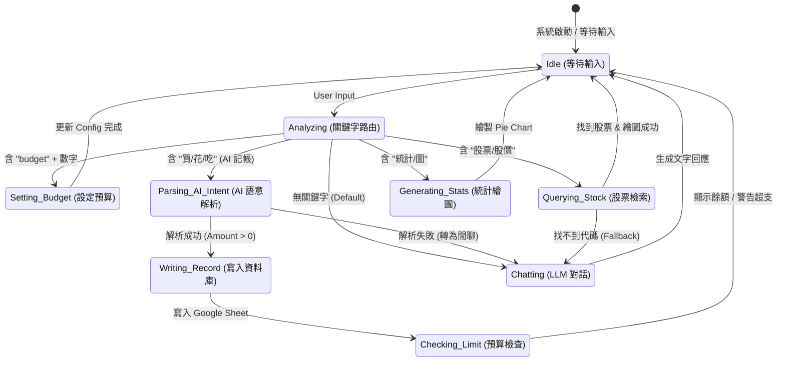

# 💰 WealthWise AI：智慧理財助手

WealthWise AI 是一個結合了 **AI 自然語言處理**、**Google Sheets 雲端記帳**與**台股即時查詢**的整合型理財工具。透過 Streamlit 打造直覺的對話介面，使用者可以輕鬆記帳、分析消費習慣並追蹤股市動態。

## 🌟 核心功能

### 1. 智慧記帳 (Accounting)
* **自然語言記帳**：AI 自動解析如「買早餐 50 元」等口語指令，自動提取項目、金額並判斷分類。
* **預算管理**：
    * 可自訂「每日預算」，資料儲存於雲端。
    * 記帳時自動檢查今日總支出，若超支將顯示紅色警示區塊。
* **Google Sheets 同步**：所有資料即時寫入雲端，格式包含日期、分類、項目與金額。

### 2. 統計分析 (Statistics)
* **消費結構圖表**：自動根據「餐飲」、「交通」、「娛樂」等類別統計，並產生 Plotly 圓餅圖。
* **消費排行榜**：自動標記出支出最高的類別，並計算總累積金額。

### 3. 股市查詢 (Stock Tracking)
* **模糊搜尋**：整合 `twstock` 套件，支援輸入關鍵字（如「台積電」）自動查找代碼與上市櫃屬性。
* **即時行情**：對接 `yfinance` 獲取最新收盤價資訊。
* **走勢圖表**：自動繪製目標股票近六個月的歷史股價線圖。

### 4. AI 智能對話 (AI Chat)
* 採用 **NCKU Gemma3:4b** 模型，提供繁體中文的理財諮詢與日常閒聊服務。

---

## 📂 檔案結構

```text
.
├── main.py             # 主程式，處理 Streamlit UI、對話紀錄管理與功能分流
├── accounting.py       # Google Sheets 讀寫、預算檢查與消費統計邏輯
├── stock_crawler.py    # 股票代碼搜尋（twstock）與股價資料抓取（yfinance）
├── ai_advisor.py       # 串接 NCKU LLM API，負責意圖判斷與 AI 對話
└── credentials.json    # Google Sheets API 服務帳號金鑰

```
## State Machine Diagram


---

## 🚀 快速開始

### 1. 安裝環境需求
clone專案
```bash
git clone https://github.com/hyt-0000/TOC_finai_project.git
cd TOC_finai_project
```
請確保您的 Python 環境已安裝以下必要套件：
```bash
pip install streamlit requests pandas plotly yfinance twstock gspread oauth2client
pip install lxml
```
## 2. Google Sheets API 設定

1. 前往 **Google Cloud Console** 建立一個「服務帳號（Service Account）」。
    1. 進入 Google Cloud Console
    2. 點擊左側選單的 「IAM 與管理」(IAM & Admin) > 「服務帳戶」(Service Accounts)
    3. 點擊上方的 「+ 建立服務帳戶」(CREATE SERVICE ACCOUNT)
    4. 輸入名稱（例如 sheets-operator），點擊「建立並繼續」 
2. 為服務帳號建立金鑰並下載 **JSON 金鑰檔案**。
    1. 在服務帳戶列表中，點擊你剛才建立的那一個帳戶
    2. 切換到上方的 「金鑰」(Keys) 標籤頁
    3. 點擊 「新增金鑰」(ADD KEY) > 「建立新金鑰」(Create new key)
    4. 選擇 「JSON」 格式，然後點擊 「建立」 
3. 將金鑰檔案命名為 `credentials.json`，並放置於專案根目錄。
4. 在 **Google Sheets** 建立一份試算表，名稱為 **`MyFinanceBook`**，並開共用給服務帳號的 email(`credentials.json`裡的`client_email`)。
5. 建立以下分頁（Sheets）：

### Sheet1
用於儲存消費紀錄，欄位如下：

| 日期 | 類別 | 項目 | 金額 |
|----|----|----|----|

### Config
- 在 **A1 儲存格** 打上`daily_budget`，**B1 儲存格** 設定每日預算金額。

---

## 3. 啟動應用程式

在專案根目錄執行以下指令：

```bash
streamlit run main.py
```
## 📝 使用範例

### 記帳
- 今天吃午餐花了 150 元
- 午餐:150

### 統計
- 幫我統計目前的消費狀況

### 設定預算
- 設定每日預算為 1000 元

### 股市查詢
- 我想了解台積電的走勢

---

## ⚠️ 注意事項

- 請確保 `main.py` 中的 `LLM_API_KEY` 要改成自己的api key，才能正常使用 AI 功能。

- 若執行時出現 `gspread` 相關錯誤，請確認：
  - `credentials.json` 是否存在於專案根目錄
  - 該服務帳號是否已被授權存取 **MyFinanceBook** 試算表  
    （需在 Google Sheets 中將試算表分享給服務帳號的 email）

